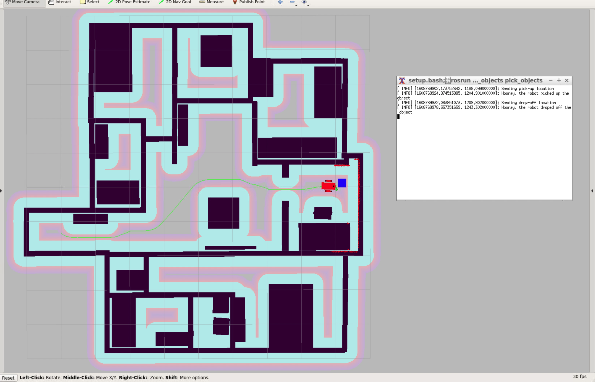

# Home Service Robot
---

[](https://www.youtube.com/watch?v=49-nGFDpmLw&feature=youtu.be)

The goal of this project is to program a robot that can take the map generated earlier, localize itself in that map, and navigate the robot to pick up and drop off virtual objects in the simulation. Click on the video above to look at a demonstration. Here is a list of steps undertaken to accomplish that goal:
 - Build a simulated world in Gazebo building editor. In my case, I used the previously built world from previous projects.
 - Build a map of the environment using RTAB Mapping and teleop.
 - Use Adaptive Monte Carlo Localisation to detect the robot position within the known map.
 - Use the ROS move_base library to plot a path to a target pose and navigate to it.
 - Write a node to sends robot a pick-up and drop-off locations
 - Write a node that subscribes to robot's location, simulates virtual object pick-up and drop-off using markers
 
 
### Directory structure
Below is the directory structure for this project

```
src
 ├──                                # Official ROS packages
    |
    ├── slam_gmapping                  # gmapping_demo.launch file                   
    │   ├── gmapping
    │   ├── ...
    ├── turtlebot                      # keyboard_teleop.launch file
    │   ├── turtlebot_teleop
    │   ├── ...
    ├── turtlebot_interactions         # view_navigation.launch file      
    │   ├── turtlebot_rviz_launchers
    │   ├── ...
    ├── turtlebot_simulator            # turtlebot_world.launch file 
    │   ├── turtlebot_gazebo
    │   ├── ...
    ├──                                # Your packages and direcotries
    |
    ├── myrobot 
    |   |-- maps                        # map files
    |   |-- worlds
    |   ├── ...
    ├── scripts                         # shell scripts files
    │   ├── ...
    ├──rvizConfig                      # rviz configuration files
    │   ├── ...
    ├──pick_objects                    # pick_objects C++ node
    │   ├── src/pick_objects.cpp
    │   ├── ...
    ├──add_markers                     # add_marker C++ node
    │   ├── src/add_markers.cpp
    │   ├── ...
    └──

```
### Prerequisites

1. ROS-Kinetic, Gazebo on Linux
2. CMake and g++
3. Install `rtabmap-ros` package: `$ sudo apt-get install ros-kinetic-rtabmap-ros`


### Launch Instructions

1. Note that the [database file](https://github.com/schandrachary/Robotics/blob/map_my_world/rtabmap-chakraworld.db) is uploaded as a git LFS(Large File Storage) since the size of the file is 349 MB. To pull this file you will also need to install LFS. Then, clone the repo and build:
```
$ mkdir catkin_ws && cd catkin_ws
$ git clone https://github.com/schandrachary/Robotics.git
$ checkout -b home_service_robot origin/home_service_robot
$ catkin_make
```
Install dependencies: 
```
$ rosdep -i install turtlebot_teleop -y
$ rosdep -i install turtlebot_rviz_launchers -y
$ rosdep -i install turtlebot_gazebo -y
```

At last, launch the `home_service.sh` script
```
$ cd src/scripts
$ ./home_service.sh
```
This should launch all the necessary nodes for the robot to navigate to pick up location, pickup the package, and navigate to drop off location and drop off the package. 

### SLAM Testing
To test SLAM, I created a [test_slam.sh](https://github.com/schandrachary/Robotics/blob/home_service_robot/src/scripts/test_slam.sh) script which launches necesssary nodes to load the robot and the world. This script also launches rviz to visualize the map created from RTABMap. Using teleop node, I used keyboard commands to navigate the robot around the enviroment to create a map of the world. I later used the `map_server` package to save the map in `.pgm` format and it can be found [here](https://github.com/schandrachary/Robotics/tree/home_service_robot/src/my_robot/maps).

### Localization and Navigation testing
I used the ROS Navigation stack, which is based on the Dijkstra's, a variant of the Uniform Cost Search algorithm, to plan our robot trajectory from start to goal position. The ROS navigation stack permits the robot to avoid any obstacle on its path by re-planning a new trajectory once the robot encounters them. I created a [pick_objects.sh](https://github.com/schandrachary/Robotics/blob/home_service_robot/src/scripts/pick_objects.sh) script which launches the AMCL localization node and a custom `pick_objects` node that assigns two goal locations for the robot to navigate to. 

### Putting it all together
Now it’s time to simulate a full home service robot capable of navigating to pick up and deliver virtual objects. To do so, the `add_markers` and `pick_objects` node should be communicating. `pick_objects` constantly publishes a custom robot location with reference to its goal location and `add_markers` display a virtual object based on the robot's location. 

Run [home_service.sh](https://github.com/schandrachary/Robotics/blob/home_service_robot/src/scripts/home_service.sh) script and notice the following behavior in RViz:

- Marker appears at the pickup zone
- Marker disappears once the robot reaches the pickup zone, indicating the package has been picked up
- Waits 5 seconds to simulate a pickup
- Marker appears at the drop off zone indicating the package has been dropped off


